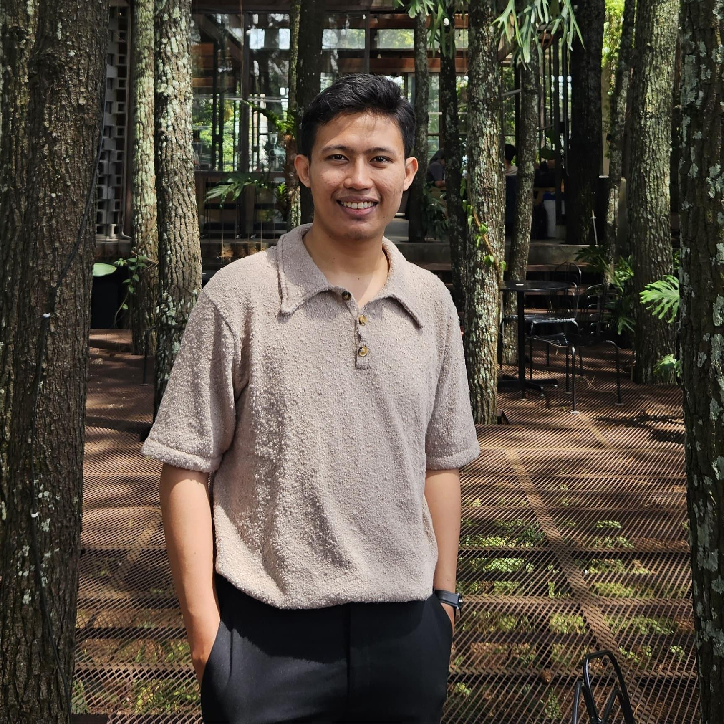

```{=html}
<div class="hero-section">
  
  <div class="hero-name">Deri Siswara</div>
  <div class="hero-tagline">Dosen dan Peneliti</div>
  
  <div class="hero-pills">
    <span class="hero-pill"><i class="fa-solid fa-chart-line"></i> Ekonometrika</span>
    <span class="hero-pill"><i class="fa-solid fa-brain"></i> Data Analysis</span>
    <span class="hero-pill"><i class="fa-solid fa-database"></i> AI &amp; Machine Learning</span>
  </div>

  <div class="hero-cta">
    <a href="tulisan/index.html" class="btn-primary-custom">Blog</a>
    <a href="materi/index.html" class="btn-outline-custom">Presentasi & Kuliah</a>
  </div>

  <div class="social-links">
    <a href="https://github.com/derisiswara" title="GitHub"><i class="fa-brands fa-github"></i></a>
    <a href="https://www.linkedin.com/in/derisiswara/" title="LinkedIn"><i class="fa-brands fa-linkedin"></i></a>
    <a href="https://scholar.google.co.id/citations?user=NNhhI5IAAAAJ&hl=en" title="Google Scholar"><i class="ai ai-google-scholar"></i></a>
    <a href="mailto:derisiswarads@gmail.com" title="Email"><i class="fa-solid fa-envelope"></i></a>
  </div>
</div>

<div class="about-section">
  <h2>Tentang Saya</h2>
  <p>
    S1 Ilmu Ekonomi, S2 Statistika. 5+ tahun pengalaman dalam ekonometrika, machine learning, riset akademik, dan analisis kebijakan lintas sektor/institusi — mencakup ekonomi regional, pasar keuangan, pemodelan prediktif, dan evaluasi dampak. Menguasai R, Python, dan STATA. Aktif sebagai pengajar dan praktisi.
  </p>
</div>

<div class="featured-section">
  <h2>Jelajahi</h2>
  <div class="featured-grid">
    
    <div class="featured-card">
      <div class="card-label">Blog</div>
      <div class="card-title">Tulisan & Analisis</div>
      <div class="card-desc">Tulisan seputar ekonometrika, AI & machine learning, analisis data, dan tools olah data.</div>
      <a href="tulisan/index.html" class="card-link">Lihat Semua →</a>
    </div>

    <div class="featured-card">
      <div class="card-label">Tutorial</div>
      <div class="card-title">R, Python &amp; STATA</div>
      <div class="card-desc">Tutorial bahasa pemrograman untuk analisis data.</div>
      <div style="margin-top: 1rem; display: flex; gap: 1rem; flex-wrap: wrap;">
        <a href="tutorial/r/index.html" class="card-link">R →</a>
        <a href="tutorial/python/index.html" class="card-link">Python →</a>
        <a href="tutorial/stata/index.html" class="card-link">STATA →</a>
      </div>
    </div>

    <div class="featured-card">
      <div class="card-label">Presentasi & Kuliah</div>
      <div class="card-title">Slides &amp; Materi</div>
      <div class="card-desc">Materi presentasi, kuliah, seminar, dan workshop.</div>
      <a href="materi/index.html" class="card-link">Lihat Semua →</a>
    </div>

    <div class="featured-card">
      <div class="card-label">Proyek</div>
      <div class="card-title">Riset & Proyek</div>
      <div class="card-desc">Proyek riset di bidang lintas sektor dan institusi.</div>
      <a href="projects/index.html" class="card-link">Lihat Semua →</a>
    </div>

    <div class="featured-card">
      <div class="card-label">Profil</div>
      <div class="card-title">CV &amp; Publikasi</div>
      <div class="card-desc">CV akademik lengkap dan profil Google Scholar.</div>
      <div style="margin-top: 1rem; display: flex; gap: 1rem;">
        <a href="https://derisiswara.art/cv/cv.pdf" class="card-link">CV (PDF) →</a>
        <a href="https://scholar.google.co.id/citations?user=NNhhI5IAAAAJ&hl=en" class="card-link">Google Scholar →</a>
      </div>
    </div>

  </div>
</div>

<div class="services-section">
  <div class="services-inner">
    <div class="services-icon"><i class="fa-solid fa-headset"></i></div>
    <h2>Layanan Konsultasi dan Olah Data</h2>
    <p>
      Saya menyediakan layanan <strong>konsultasi dan data</strong> untuk kebutuhan riset, tugas akhir (skripsi/tesis/disertasi), maupun analisis data profesional. Metode yang tersedia meliputi ekonometrika, statistika, spasial, machine learning, dan lainnya.
    </p>
    <div class="services-contact">
      <a href="https://wa.me/6281384548488" class="services-btn">
        <i class="fa-brands fa-whatsapp"></i> 0813-8454-8488
      </a>
      <a href="mailto:derisiswarads@gmail.com" class="services-btn services-btn-outline">
        <i class="fa-solid fa-envelope"></i> derisiswarads@gmail.com
      </a>
    </div>
  </div>
</div>
```
